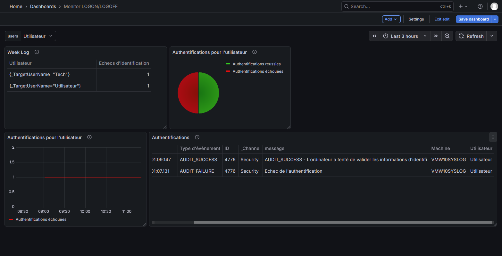
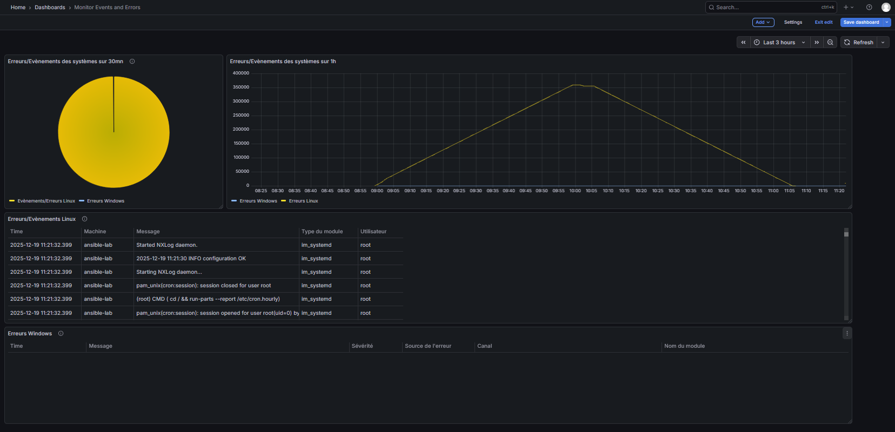

# Grafana Cross-Platform Log & Event Monitor

## Status
*Project in development (as of December 19, 2025). Configurations and dashboards may evolve — keep them updated.*

## Overview
**Grafana CPL & EM** provides centralized monitoring of Windows and Linux authentication events and system logs.  
It aggregates login activity, system events, error reports, and user‑management actions from both Windows and Linux systems.

## 📸 Screenshots
  

## 🎯 Key Features
- Real-time monitoring of authentication events and system errors  
- Automatic extraction of critical fields:
  - User, source workstation, event type, timestamp  
- Multiple dashboards tailored for specific use cases  
- Intuitive Grafana visualizations (tables, time series, charts)  
- Lightweight architecture using NXLog + Alloy

## 🏗️ Architecture
**Flow:** Windows/Linux → NXLog → Alloy (Grafana Agent) → Loki → Grafana  

**Components:**
1. **NXLog** – Collects Windows/Linux logs  
2. **Alloy (Grafana Agent)** – Syslog reception & parsing  
3. **Loki** – Structured log storage  
4. **Grafana** – Visualization & dashboards  

> Configuration files are in the `configs` folder. Update IP/PORT values as needed. Dashboards are in the `dashboards` folder.

## 📈 Dashboards
### 1. Windows Login Monitor
- Tracks successful and failed login attempts  
- Highlights authentication errors and connection issues  

### 2. System Error Monitor
- Displays Linux and Windows system errors  
- Sources: Windows Event Viewer, Linux systemd logs  

### 3. Unified Events & Errors Dashboard
- Consolidates authentication events and system errors in one view  
- Uses **business inputs** and dynamic variables (hostname, IP)  
- Enables flexible, dynamic filtering across the infrastructure  

## Log Ingestion (GELF)
**GELF (Graylog Extended Log Format)** ensures structured, efficient log collection.  

- **Pipeline:** Logs → GELF listener → Observability stack  
- **Advantages:**
  - JSON-based structured data (easy parsing & querying)  
  - Compression support for bandwidth efficiency  
  - Extensible with custom fields (`_field`) for context  
